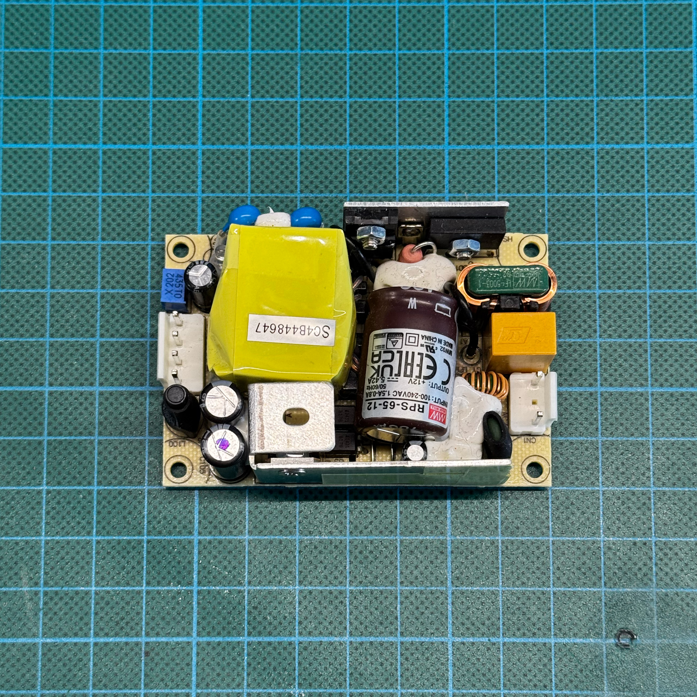
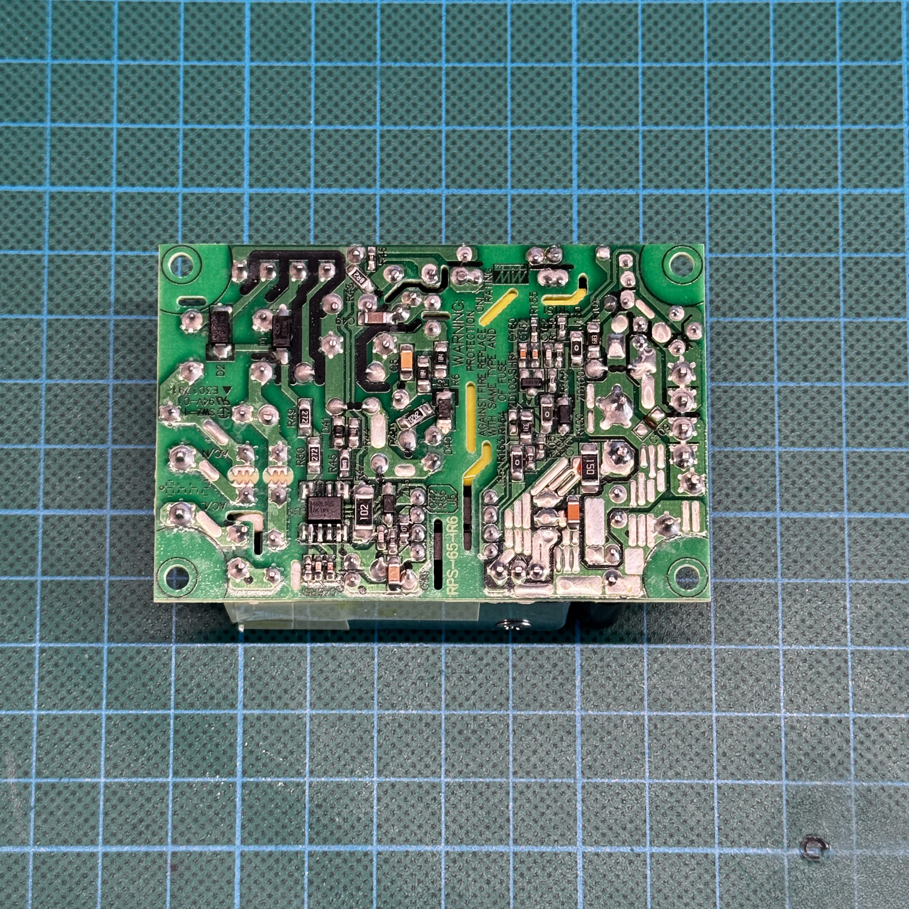
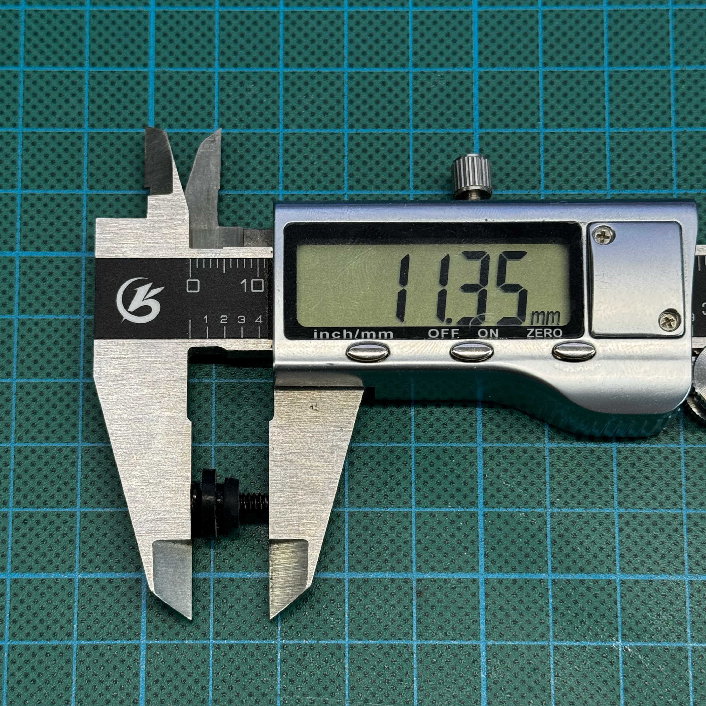
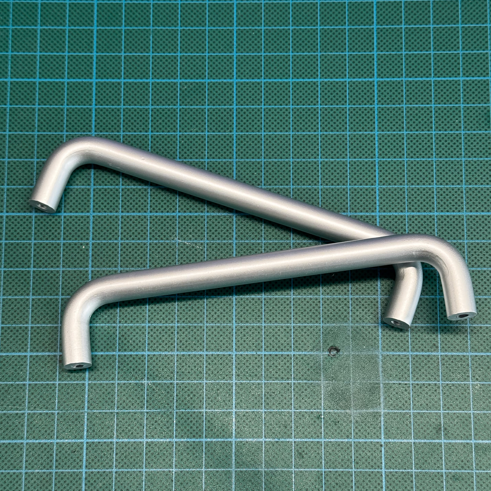
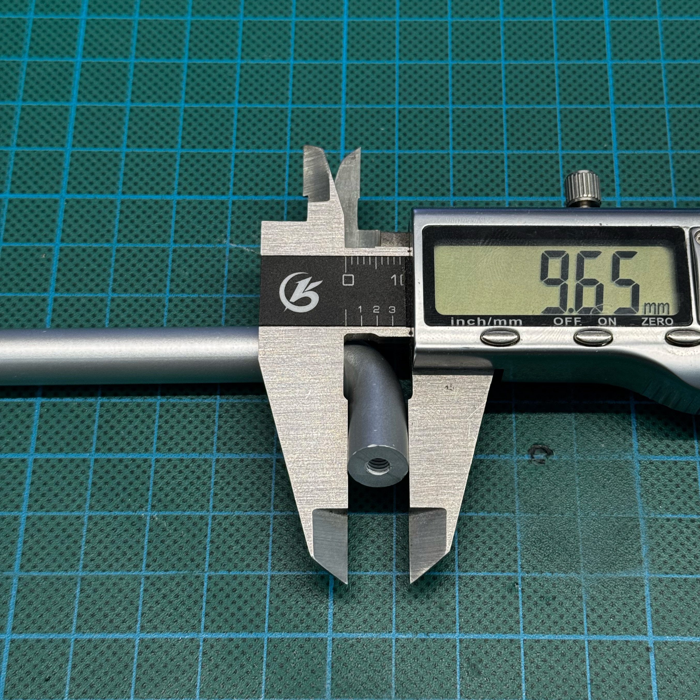
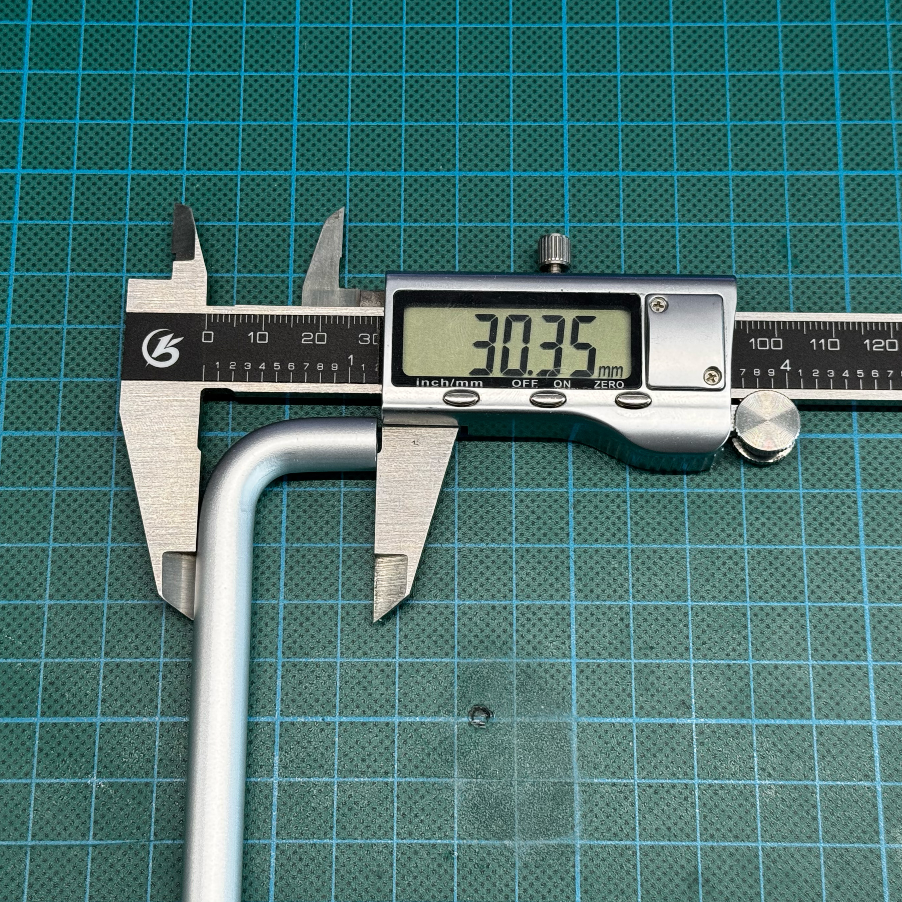
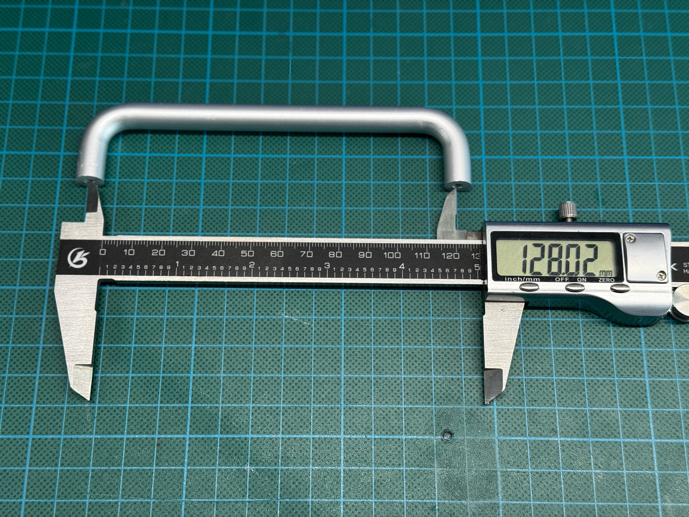

# 🧩 Parts list

This page lists the hardware parts required to build the **Chronology NAS** physical enclosure.

The current build uses a custom 3D-printed case, an x86 Chromebox board, internal AC-DC power supply, internal drive with hot-swap approach.

> [!CAUTION]
> This build contains mains-powered AC-DC components. Use only suitable parts, proper insulation, strain relief, and safe wiring practices.

---

## 🧭 Parts navigation

| ID | Part                       | Section                                          |
| -: | -------------------------- | ------------------------------------------------ |
| 01 | x86 Chromebox              | [Chromebox](#chromebox)                       |
| 02 | 3D-printed enclosure       | [Enclosure](#3d-printed-enclosure)            |
| 03 | AC-DC PSU                  | [AC-DC PSU](#ac-dc-psu)                       |
| 04 | AC input parts             | [AC input](#ac-input-parts)                   |
| 05 | Low-voltage wiring         | [DC wiring](#05-low-voltage-dc-wiring)           |
| 06 | Chromebox power connector  | [Power connector](#06-chromebox-power-connector) |
| 07 | Storage interface          | [Storage interface](#07-storage-interface)       |
| 08 | Drive sleds                | [Drive sleds](#08-drive-sleds)                   |
| 09 | SATA drives                | [Drives](#09-sata-drives)                        |
| 10 | Screws, inserts, standoffs | [Fasteners](#10-fasteners-inserts-and-standoffs) |
| 11 | Thermal service parts      | [Thermal parts](#11-thermal-service-parts)       |
| 12 | Vibration damping          | [Vibration damping](#vibration-damping)       |
| 13 | Optional cooling           | [Optional cooling](#13-optional-cooling)         |

---

<a id="chromebox"></a>

## 01 — 💻 Chromebox

| Field        | Value                                                |
| ------------ | ---------------------------------------------------- |
| Page link    | TBD                                                  |
| Function     | Main x86 board                                       |
| Notes        | TBD |

<details>
  
<summary><strong>How to choose an alternative / reference notes</strong></summary>

<br>

Look for:

* ASUS / HP / Acer / Dell Chromebox models;
* Intel or AMD x86_64 CPU;
* removable case;
* accessible motherboard;
* USB 3.0 ports;
* Ethernet port;
* replaceable RAM and SSD if possible.

Avoid:

* ARM ChromeOS devices;
* devices with unknown firmware state;
* units with liquid damage;
* units without power adapter unless you are ready to verify the required voltage/current.

Reference photos to add:

```text
assets/photos/parts/chromebox-front.jpg
assets/photos/parts/chromebox-opened.jpg
assets/photos/parts/chromebox-board.jpg
assets/photos/parts/chromebox-power-input.jpg
```

</details>

---

<a id="3d-printed-enclosure"></a>

## 🧱 3D-printed enclosure

| Field        | Value                                                |
| ------------ | ---------------------------------------------------- |
| Page link    | TBD                                                  |
| Function     | Main x86 board                                       |
| Notes        | TBD |

---

<details>
The enclosure contains:

| Field                    | Value                                                     |
| ------------------------ | --------------------------------------------------------- |
| **Core chassis**         | Main load-bearing internal structure                      |
| **Outer support frame**  | Secondary frame installed over the core chassis           |
| **Outer shell**          | External visible body / facade of the enclosure           |
| **Drive ejector levers** | Printed levers used to push drives out                    |
| **Power button bracket** | Small internal beam/bracket for mounting the power button |
| **Top cover parts**      | Decorative protective covers above ventilation openings   |
| **I/O port cover**       | Cover for the Chromebox board I/O port area               |

<br>


```text
cad/enclosure/
cad/drive-sleds/
assets/photos/parts/enclosure-overview.jpg
assets/photos/parts/enclosure-top-mesh.jpg
assets/photos/parts/enclosure-drive-bay.jpg
```

</details>

---

<a id="ac-dc-psu"></a>

## 03 — 🔌 AC-DC PSU

| Field        | Value                                                               |
| ------------ | ------------------------------------------------------------------- |
| Current part | **Mean Well RPS-65-12**                                             |
| Output       | 12 V / 5.42 A                                                       |
| Rated power  | 65 W                                                                |
| Function     | Internal power supply for the Chromebox and drives                  |
| Notes        | I do **not** recommend replacing this PSU with a random alternative |

> [!CAUTION]
> This part works with mains voltage. Incorrect AC wiring, poor insulation, missing strain relief, or unsafe mounting may cause electric shock, fire, hardware damage, injury, or death.
> Do not work on the PSU while it is connected to mains power. Verify wiring, polarity, insulation, clearances, and mechanical fixation before first power-on.


<details><summary><strong>Reference notes</strong></summary>

<br>

The current build uses a **Mean Well RPS-65-12**.

>I do not recommend replacing it with a random low-cost AC-DC module. The RPS series is a certified medical/open-frame power supply family designed for built-in equipment (medical / biochemical inspection instruments / BF-rated patient-contact medical equipment when used with appropriate system design). It provides proper isolation, documented safety approvals, low >leakage current, and standard protection features such as short-circuit, overload, and overvoltage protection.

The 65 W rating is also intentionally oversized for this build.

Measured maximum power consumption in the current test setup:

| Test condition                                                      | Measured power |
| ------------------------------------------------------------------- | -------------: |
| CPU + iGPU + RAM stress test + HDD Victoria mechanical/surface test |         < 35 W |
| IDLE + HDD not parked                                               |         < 18 W |
| IDLE + HDD parked                                                   |         < 14 W |
| System OFF                                                          |          < 1 W |


This means the PSU is not operated near its limit during the tested worst-case load. The remaining power margin is intentional and helps avoid running the PSU at the edge of its rating.

<table>
  <tr>
    <td width="50%"></td>
    <td width="50%"></td>
  </tr>
</table>

</details>

---

<a id="ac-input-parts"></a>

## 04 — ⚡ AC input parts


| Field        | Value                                                  |
| ------------ | ------------------------------------------------------ |
| Current part | TBD                                                    |
| Function     | Mains power input for the internal AC-DC PSU           |
| Notes        | The socket must match the specified dimensions exactly |

> [!CAUTION]
> This part is connected to mains voltage. Incorrect wiring, poor insulation, or exposed live terminals may cause electric shock, fire, injury, or death.

<details>

The AC input socket must match the specified size and shape exactly.

The enclosure design uses minimal mechanical tolerances around this component. A socket with a different body shape, mounting hole spacing, flange size, terminal position, or overall depth may not fit the printed enclosure.

Before buying an alternative, verify:

<table>
  <tr>
    <td width="50%"></td>
    <td width="50%"></td>
  </tr>
</table>

</details>


---

<a id="05-low-voltage-dc-wiring"></a>

## 05 — 🔋 Low-voltage DC wiring


| Field    | Value                                         |
| -------- | --------------------------------------------- |
| Required | ✅ Yes                                         |
| Quantity | 1 set                                         |
| Voltage  | 12 V DC                                       |
| Function | Distributes 12 V power inside the enclosure   |
| Notes    | Wire gauge depends on drive count and current |


---

<a id="07-storage-interface"></a>

## 07 — 💾 Storage interface


| Field        | Value                                            |
| ------------ | ------------------------------------------------ |
| Current part | TBD                                              |
| Function     | Connects SATA drives to the Chromebox            |
| Notes        | Exact implementation depends on the final design |

<details>
<summary><strong>How to choose an alternative / reference notes</strong></summary>

<br>

Search keywords:

```text
USB 3.0 SATA adapter UASP
USB SATA bridge board
USB 3.0 to SATA 22 pin
USB SATA adapter 3.5 HDD 12V
```

Check:

* USB 3.0 support;
* UASP support;
* SATA connector orientation;
* 2.5" / 3.5" drive compatibility;
* external 12 V power support if needed;
* bridge chip reputation;
* board dimensions;
* cable direction.

Avoid:

* bus-powered 3.5" HDD setups;
* very thin USB cables;
* adapters without clear power input;
* boards that physically block drive sled movement.

Reference photos to add:

```text
assets/photos/parts/storage-interface-board.jpg
assets/photos/parts/storage-interface-mounted.jpg
assets/photos/parts/sata-connector-alignment.jpg
```

</details>

---

<a id="vibration-damping"></a>

## 12 — 🧽 3.5" HDD vibration rails

| Field    | Value                                                                                                            |
| -------- | ---------------------------------------------------------------------------------------------------------------- |
| Function | Reduces HDD vibration, slightly reduces noise, and works as guide rails for installing drives into the enclosure |
| Notes    | Use the **3.5" HDD version**. Do not accidentally buy the 2.5" version                                           |

<details><summary><strong>How to choose an alternative / reference notes</strong></summary>

<br>

These rubber parts are screwed directly to the side mouning holes of a 3.5" hard drive.

In this build they have two functions:

* they dampen HDD vibration and slightly reduce transmitted noise;
* they act as slide-in guide rails for installing the drive into the enclosure.

This is a common generic part sold by many sellers. The exact listing may disappear, so it is better to identify the part by its shape, dimensions, and mounting style rather than by a single product link.

> [!IMPORTANT]
> Make sure you buy the version for **3.5" HDDs**. Similar-looking parts for **2.5" drives** are smaller and will not fit this design correctly.

---

Reference listing screenshots:

<table>
  <tr>
    <td width="65%">
      
      <br>
      <sub>Example listing</sub>
    </td>
    <td width="35%">
      
      <br>
      <sub>Seller dimension reference</sub>
    </td>
  </tr>
</table>

### Search keywords

AliExpress-style search terms:

```text
Hard Disk Drive Shock Absorption Screws
HDD Shock Absorption Screws
Case Shockproof Screws Shockproof Screws + Shock Absorption 3.5-inch
```

---

### Reference measurements

| Measurement |  Value |
| ----------- | -----: |
| Length      | 11.2-11.3mm |
| Width 1     | 10 mm |
| Width 2     | 7.5 mm |

Recommended reference photos:

<table>
  <tr>
    <td width="50%">
      
      <br>
      <sub>Length measurement</sub>
    </td>
    <td width="50%">
      
      <br>
      <sub>Width 1 measurement</sub>
    </td>
  </tr>
  <tr>
    <td width="50%">
      
      <br>
      <sub>Width 2 measurement</sub>
    </td>
    <td width="50%">
      
      <br>
      <sub>General appearance</sub>
    </td>
  </tr>
</table>

</details>


<a id="aluminium-feet"></a>

## 🦶 Aluminium feet

| Field    | Value                                                                  |
| -------- | ---------------------------------------------------------------------- |
| Function | Works as external feet / support legs for the enclosure                |
| Notes    | Originally sold as aluminium furniture handles, used here as case feet |

<details><summary><strong>How to choose an alternative / reference notes</strong></summary>

<br>

These parts are originally sold as **aluminium furniture handles**, but in this build they are used as external feet / support legs for the enclosure.

Similar parts can also be found in polished steel. The exact material is less important than the geometry.

The current design is based around the following approximate dimensions:

| Measurement                   |  Value |
| ----------------------------- | -----: |
| Diameter                      | ~10 mm |
| Total length                  | 136 mm |
| Distance between hole centers | 128 mm |

> IMPORTANT
> The hole spacing and overall length are important. A handle with a different mounting distance may not fit the printed enclosure without modifying the CAD model.

---

Reference appearance:

<table>
  <tr>
    <td width="100%">
      
      <br>
      <sub>General appearance</sub>
    </td>
  </tr>
</table>

---

Reference listing screenshot:


### Search keywords

AliExpress-style search terms:

```text
Solid Handle Wardrobe Door Cabinet U-shaped Cabinet Door Industrial Thread U-shaped Box Handle Minimalist
Steel U Type Door Handles Dresser Knobs Kitchen Cabinet Knobs and Handles for Furniture Hardware
Modern Cabinet Door Handles Minimalist Silver Wardrobe Cupboard Aluminum Alloy Door Handle Nordic Drawer Door Knobs Pulls
```

---

### Reference measurements

Reference photos:

<table>
  <tr>
    <td width="50%">
      
      <br>
      <sub>Measurement 1</sub>
    </td>
    <td width="50%">
      
      <br>
      <sub>Measurement 4</sub>
    </td>
  </tr>
  <tr>
    <td width="50%">
      
      <br>
      <sub>Measurement 2</sub>
    </td>
    <td width="50%">
      
      <br>
      <sub>Measurement 3</sub>
    </td>
  </tr>
</table>

</details>
