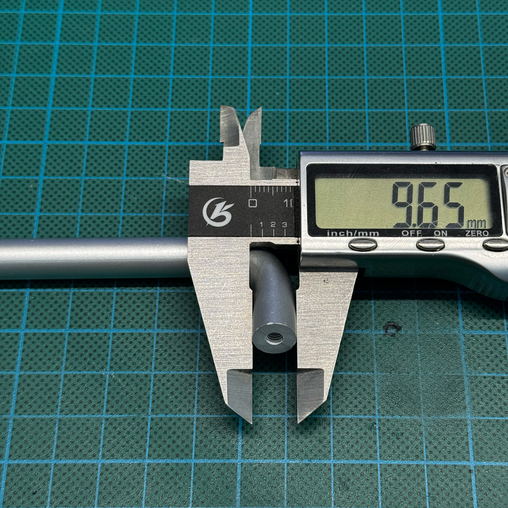
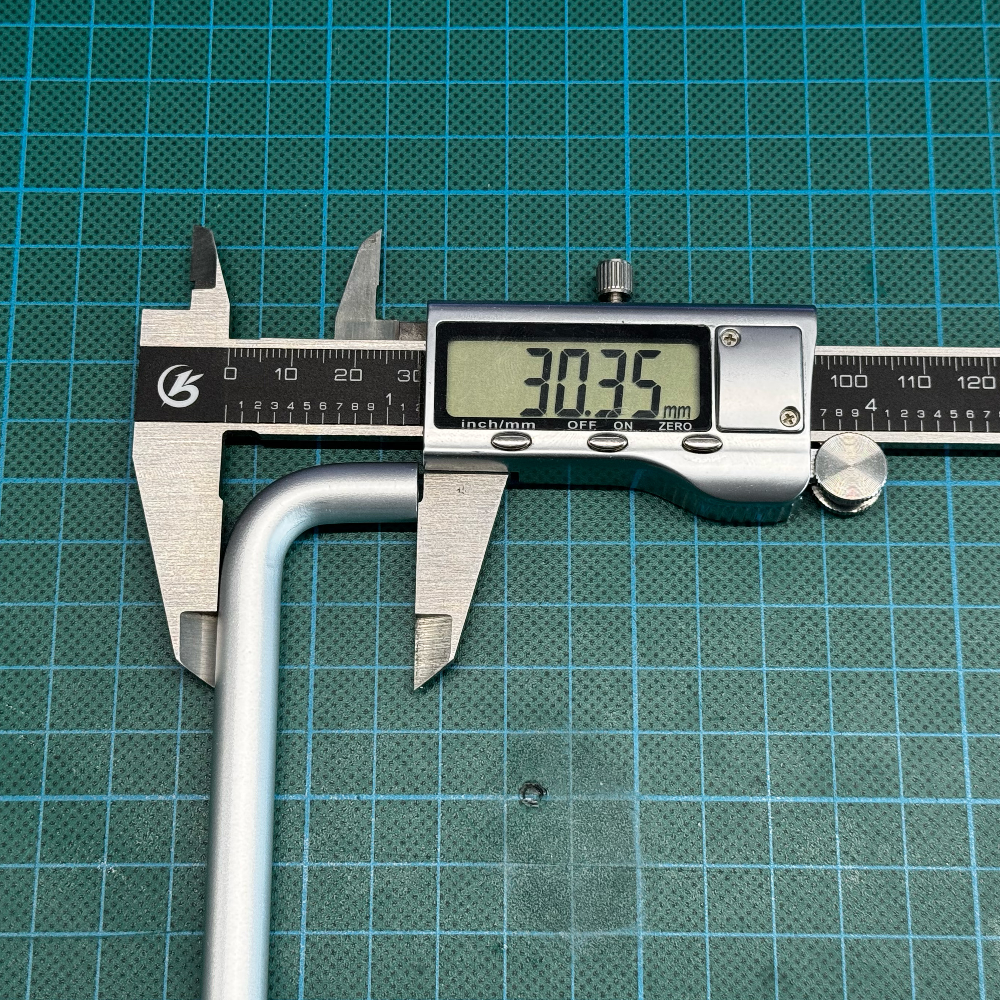
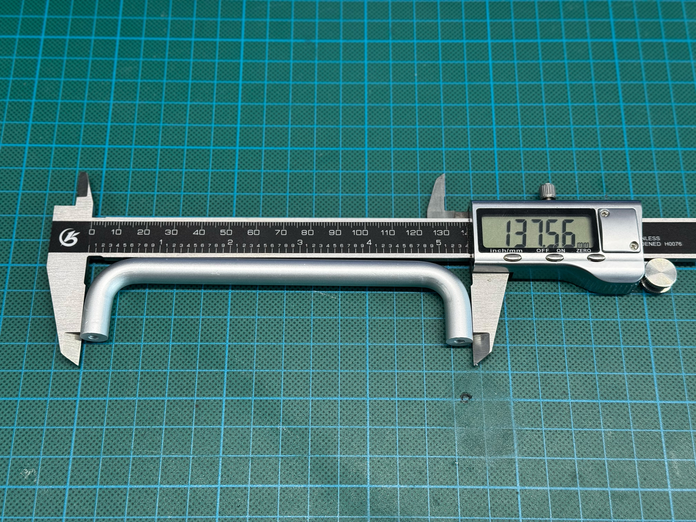
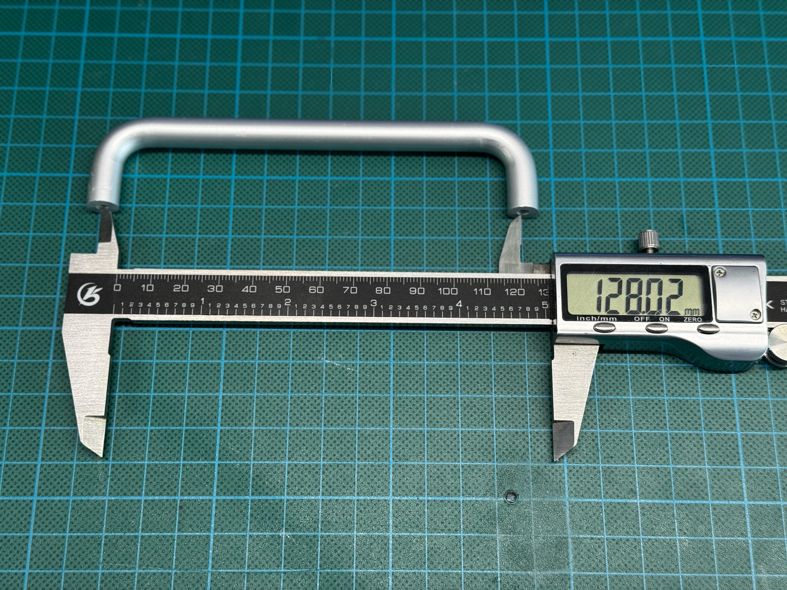

## ⚡ AC input parts

| Field        | Value                                                  |
| ------------ | ------------------------------------------------------ |
| Current part | TBD                                                    |
| Function     | Mains power input for the internal AC-DC PSU           |
| Notes        | The socket must match the specified dimensions exactly |

> [!CAUTION]
> This part is connected to mains voltage. Incorrect wiring, poor insulation, or exposed live terminals may cause electric shock, fire, injury, or death.

 

The AC input socket must match the specified size and shape exactly.

The enclosure design uses minimal mechanical tolerances around this component. A socket with a different body shape, mounting hole spacing, flange size, terminal position, or overall depth may not fit the printed enclosure.

Before buying an alternative, verify:
### Reference measurements

Reference photos:

<table>
  <tr>
    <td width="50%">
      
       
      Measurement 1
    </td>
    <td width="50%">
      
       
      Measurement 4
    </td>
  </tr>
  <tr>
    <td width="50%">
      
       
      Measurement 2
    </td>
    <td width="50%">
      
       
      Measurement 3
    </td>
  </tr>
</table>
