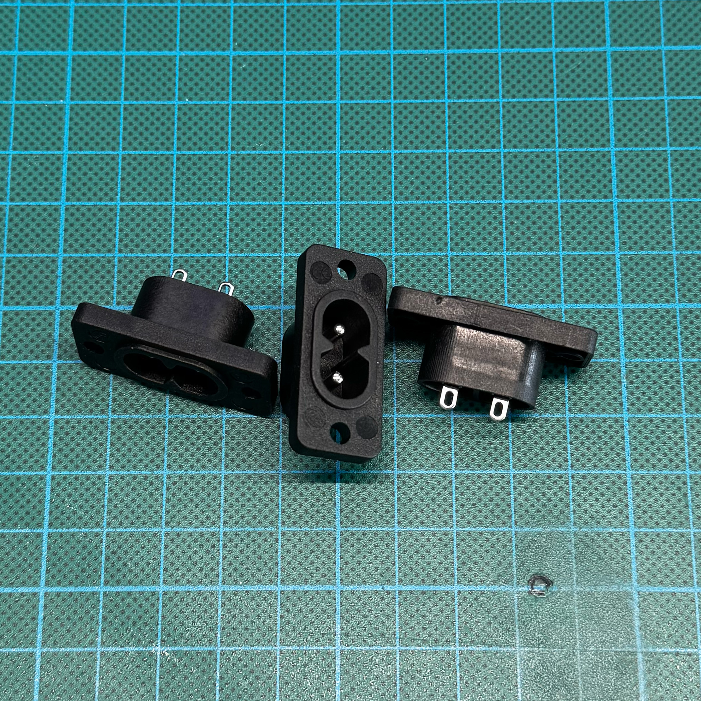

# ⚡ AC input parts

| Field    | Value                                                        |
| -------- | ------------------------------------------------------------ |
| Function | Mains power input for the internal AC-DC power supply        |
| Notes    | The socket must match the specified size and shape precisely |

> IMPORTANT
> This part is connected to mains voltage. Incorrect wiring, poor insulation, missing strain relief, or exposed live terminals may cause electric shock, fire, injury, or death.

This part is the AC mains input socket used to bring power into the enclosure and feed the internal AC-DC power supply.

The enclosure is designed with minimal tolerances around this component. A socket with a different body shape, flange size, mounting hole spacing, terminal position, or overall depth may not fit the printed case.

Do not assume that another visually similar AC socket will fit without checking dimensions.

---

## Reference appearance

<table>
  <tr>
    <td width="100%">
      
      <br>
      <sub>General appearance</sub>
    </td>
  </tr>
</table>

---

## Reference listing screenshot

<table>
  <tr>
    <td width="60%">
      
      <br>
      <sub>Example listing</sub>
    </td>
    <td width="40%">
      
      <br>
      <sub>Seller dimension reference</sub>
    </td>
  </tr>
</table>

---

## Search keywords

AliExpress-style search terms:

```text
TBD
TBD
TBD
```

---

## Reference measurements

Reference photos:

<table>
  <tr>
    <td width="50%">
      
      <br>
      <sub>Measurement 1</sub>
    </td>
    <td width="50%">
      
      <br>
      <sub>Measurement 2</sub>
    </td>
  </tr>
  <tr>
    <td width="50%">
      
      <br>
      <sub>Measurement 3</sub>
    </td>
    <td width="50%">
      
      <br>
      <sub>Seller dimensions</sub>
    </td>
  </tr>
</table>
