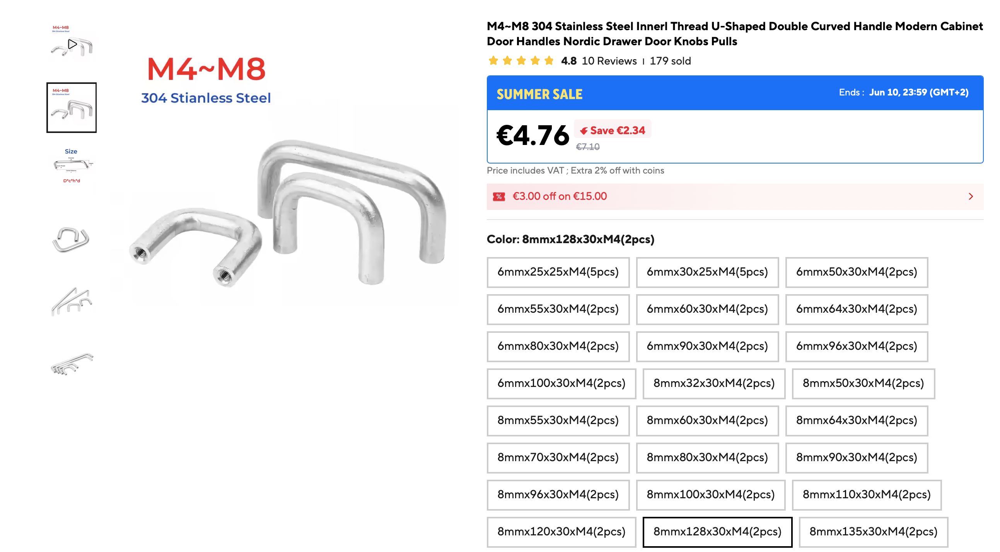
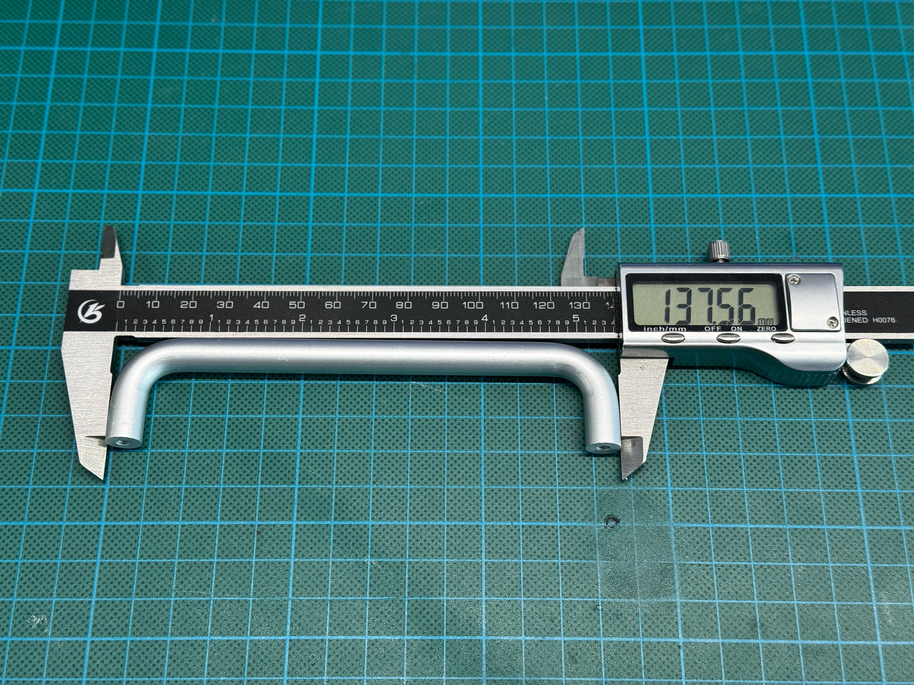

## 🦶 Aluminium feet

| Field    | Value                                                                  |
| -------- | ---------------------------------------------------------------------- |
| Function | Works as external feet / support legs for the enclosure                |
| Notes    | Originally sold as aluminium furniture handles, used here as case feet |

<br>

These parts are originally sold as **aluminium furniture handles**, but in this build they are used as external feet / support legs for the enclosure.

Similar parts can also be found in polished steel. The exact material is less important than the geometry.

The current design is based around the following approximate dimensions:

| Measurement                   |  Value |
| ----------------------------- | -----: |
| Diameter                      | ~10 mm |
| Total length                  | 136 mm |
| Distance between hole centers | 128 mm |
| Screw type                    | M4     |

> IMPORTANT
> The hole spacing and overall length are important. A handle with a different mounting distance may not fit the printed enclosure without modifying the CAD model.

---

Reference appearance:

<table>
  <tr>
    <td width="100%">
      
      <br>
      <sub>General appearance</sub>
    </td>
  </tr>
</table>

---

Reference listing screenshot:



### Search keywords

AliExpress-style search terms:

```text
Solid Handle Wardrobe Door Cabinet U-shaped Cabinet Door Industrial Thread U-shaped Box Handle Minimalist
Steel U Type Door Handles Dresser Knobs Kitchen Cabinet Knobs and Handles for Furniture Hardware
Modern Cabinet Door Handles Minimalist Silver Wardrobe Cupboard Aluminum Alloy Door Handle Nordic Drawer Door Knobs Pulls
```

---

### Reference measurements

Reference photos:

<table>
  <tr>
    <td width="50%">
      
      <br>
      <sub>Measurement 1</sub>
    </td>
    <td width="50%">
      
      <br>
      <sub>Measurement 4</sub>
    </td>
  </tr>
  <tr>
    <td width="50%">
      
      <br>
      <sub>Measurement 2</sub>
    </td>
    <td width="50%">
      
      <br>
      <sub>Measurement 3</sub>
    </td>
  </tr>
</table>
