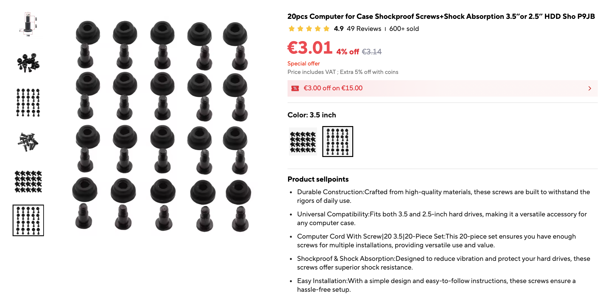
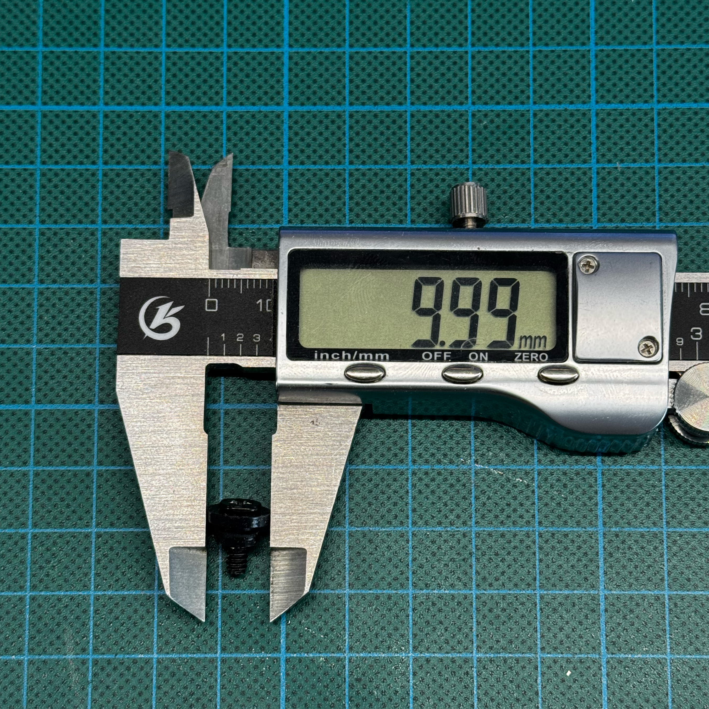
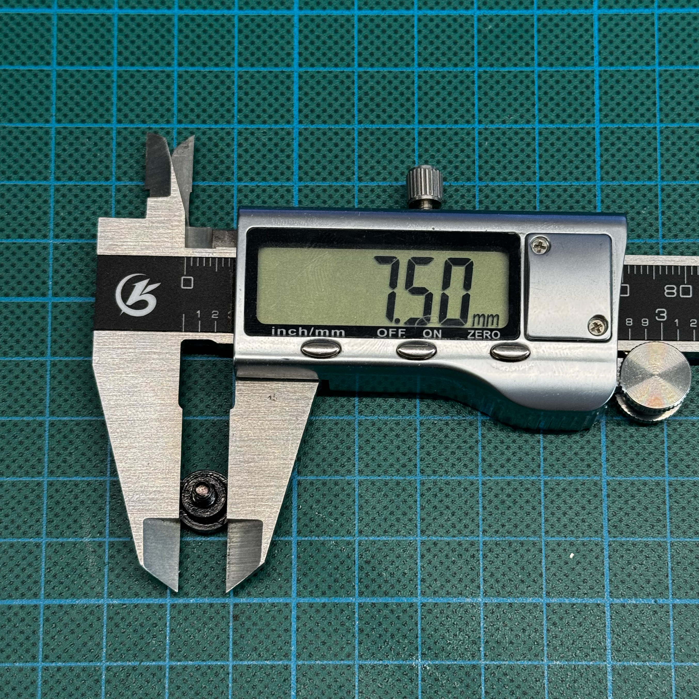
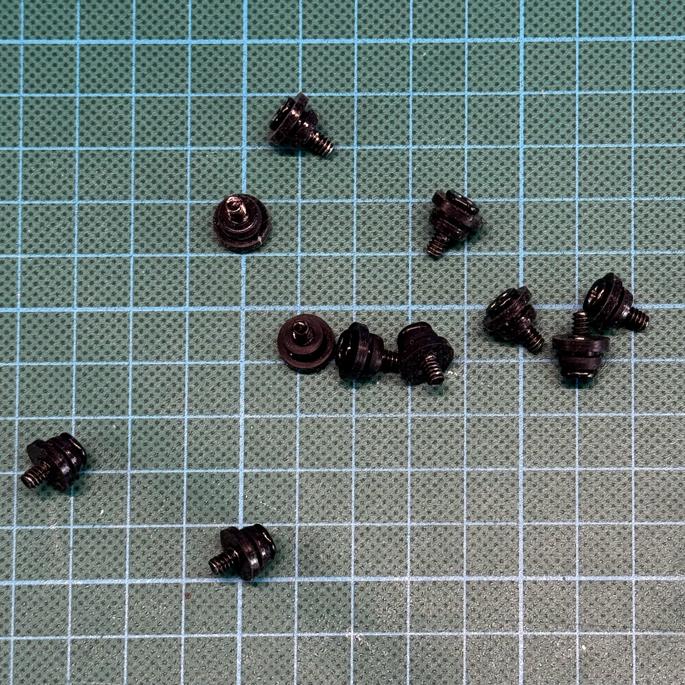

## 🧽 3.5" HDD vibration rails

| Field    | Value                                                                                                            |
| -------- | ---------------------------------------------------------------------------------------------------------------- |
| Function | Reduces HDD vibration, slightly reduces noise, and works as guide rails for installing drives into the enclosure |
| Notes    | Use the **3.5" HDD version**. Do not accidentally buy the 2.5" version                                           |

<br>

These rubber parts are screwed directly to the side mouning holes of a 3.5" hard drive.

In this build they have two functions:

* they dampen HDD vibration and slightly reduce transmitted noise;
* they act as slide-in guide rails for installing the drive into the enclosure.

This is a common generic part sold by many sellers. The exact listing may disappear, so it is better to identify the part by its shape, dimensions, and mounting style rather than by a single product link.

> IMPORTANT
> Make sure you buy the version for **3.5" HDDs**. Similar-looking parts for **2.5" drives** are smaller and will not fit this design correctly.

---

Reference listing screenshots:

<table>
  <tr>
    <td width="65%">
      
      <br>
      <sub>Example listing</sub>
    </td>
    <td width="35%">
      
      <br>
      <sub>Seller dimension reference</sub>
    </td>
  </tr>
</table>

### Search keywords

AliExpress-style search terms:

```text
Hard Disk Drive Shock Absorption Screws
HDD Shock Absorption Screws
Case Shockproof Screws Shockproof Screws + Shock Absorption 3.5-inch
```

---

### Reference measurements

| Measurement |  Value |
| ----------- | -----: |
| Length      | 11.2-11.3mm |
| Width 1     | 10 mm |
| Width 2     | 7.5 mm |

Recommended reference photos:

<table>
  <tr>
    <td width="50%">
      
      <br>
      <sub>Length measurement</sub>
    </td>
    <td width="50%">
      
      <br>
      <sub>Width 1 measurement</sub>
    </td>
  </tr>
  <tr>
    <td width="50%">
      
      <br>
      <sub>Width 2 measurement</sub>
    </td>
    <td width="50%">
      
      <br>
      <sub>General appearance</sub>
    </td>
  </tr>
</table>
