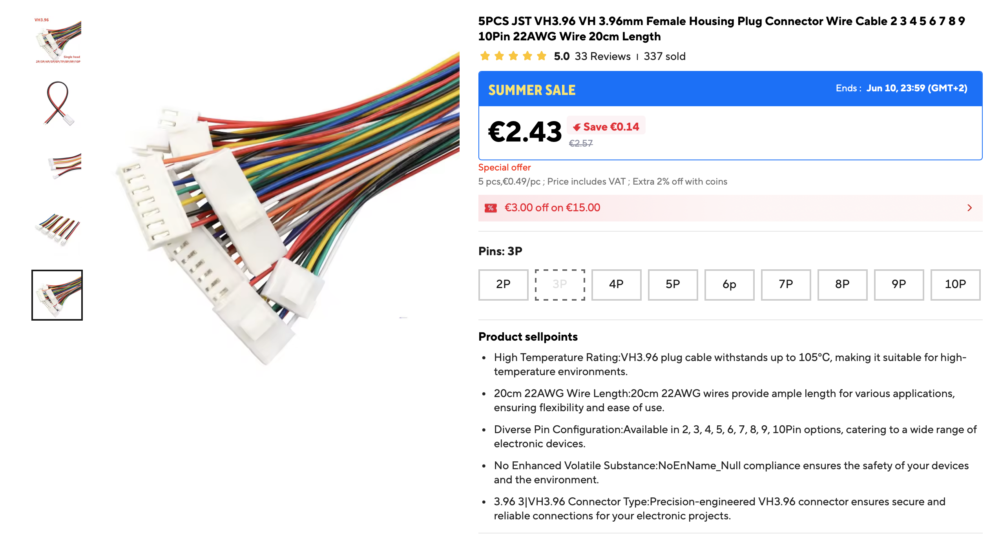

## 🔋 Wiring

| Field    | Value                                                                 |
| -------- | --------------------------------------------------------------------- |
| Function | Internal low-voltage wiring for the PSU, Chromebox, and drive power   |
| Notes    | Use pre-crimped **JST VH 3.96 mm** wires if you do not have a crimper |

<br>

For this build I used ready-made pre-crimped wires with **JST VH 3.96 mm** connectors.

This is a practical option because many people do not have a proper crimper for JST-style terminals. Instead of crimping every contact manually, you can buy ready-made wire harnesses and rearrange the wires inside the plastic housings.

Required wire harnesses:

| Connector             | Quantity |
| --------------------- | -------: |
| JST VH 3.96 mm, 4-pin |        1 |
| JST VH 3.96 mm, 3-pin |        1 |

<strong>Recomended length 20 cm</strong>

The plastic connector housings can be disassembled carefully. With a toothpick or another thin non-metallic tool, the crimped terminals can be released from the housing and inserted back in the required color order.

> IMPORTANT
> Use **JST VH 3.96 mm** parts. Do not confuse them with smaller JST XH / PH style connectors.

---

Reference appearance:


---

Reference listing screenshot:



### Search keywords

AliExpress-style search terms:

```text
JST VH3.96 VH 3.96mm Female Housing Plug Connector Wire Cable 2 3 4 5 6 7 8 9 10Pin 22AWG Wire 20cm Length
```

---

### Reassembling the wire order

Reference photos:

<table>
  <tr>
    <td width="50%">
      
      <br>
      <sub>Removing wires from the original connector housing</sub>
    </td>
    <td width="50%">
      
      <br>
      <sub>Reassembled connector with the required wire order</sub>
    </td>
  </tr>
</table>

</details>
